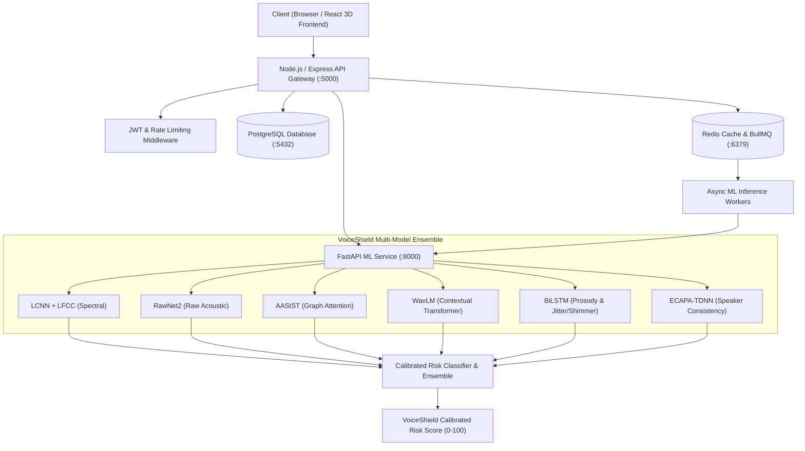

# VoiceShield System Architecture

## 1. High-Level Architecture Overview

VoiceShield is built on a decoupled, horizontally scalable multi-tier architecture engineered for enterprise throughput and real-time deepfake audio detection:

---

## 2. Component Specifications

### 2.1 React 3D Web Frontend (`frontend/`)
- **Technology**: React 18, TypeScript, Vite, TailwindCSS, Three.js, React Three Fiber (`@react-three/fiber`), `@react-three/drei`.
- **Key Features**:
  - Interactive 3D Threat/Risk Sphere and Dynamic Audio Waveform Visualizer.
  - Multi-model agreement consensus visualizers.
  - Full authentication (Signup, Signin, Password recovery, Email verification).
  - Audio recording and multi-format drag-and-drop detection upload.
  - Detection history, threat map, and user privacy center.

### 2.2 Node.js API Gateway (`backend/`)
- **Technology**: Node.js, Express, TypeScript, Helmet, CORS, Axios, JWT, Bcrypt.
- **Responsibilities**:
  - Client authentication and token refresh lifecycle.
  - Input validation, file size limits (50MB), and path traversal prevention.
  - Rate limiting (token bucket / IP-based) to safeguard inference workers.
  - Persisting detection audit trails and user sessions to PostgreSQL.
  - Async task dispatching to Redis queues for heavy batch jobs.

### 2.3 FastAPI ML Inference Service (`ml-service/`)
- **Technology**: FastAPI, PyTorch, Librosa, Scipy, SoundFile, NumPy.
- **Responsibilities**:
  - Multi-model ensemble inference pipeline.
  - Model caching and singleton lifecycle management.
  - Audio feature extraction (LFCC, Log-Mel, Prosody, Raw waveforms).
  - Sub-30ms CPU forward passes.
  - Calibrated probability mapping (0–100 VoiceShield Risk Score).

---

## 3. Scalability to 100,000 Concurrent Requests

To handle massive concurrent request surges:
1. **Stateless API Gateway Layer**: Deploy $N$ replicas of the Node.js API behind an AWS ALB or Nginx reverse proxy.
2. **Asynchronous Request Queuing**: High-volume uploads are queued in Redis via BullMQ, decoupling client upload from GPU/CPU inference.
3. **Autoscaling ML Worker Pool**: ML inference containers scale independently based on queue depth metrics.
4. **Model Checkpoint Sharing**: Pre-warmed model weights are shared via read-only container volumes.
